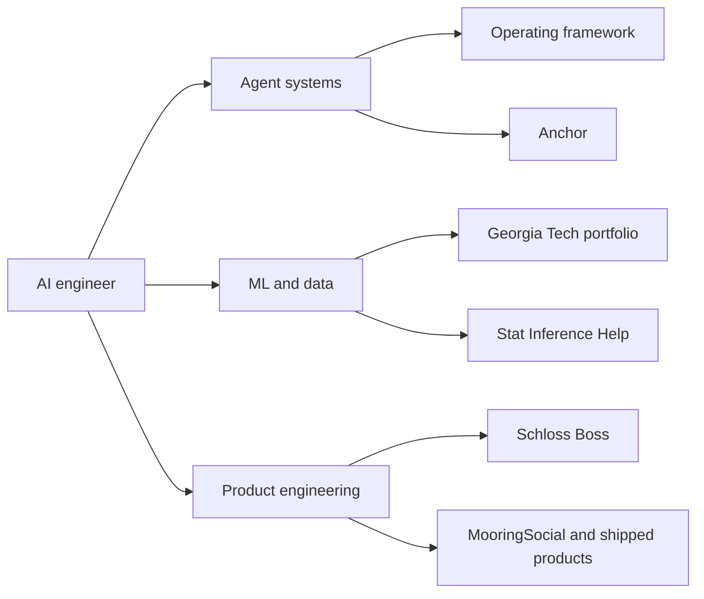

# AI Engineering

I am Matt Schlosser: former AP Statistics and BC Calculus teacher, Georgia Tech MS Analytics graduate, and production ML/data engineer.

I build AI systems with Claude Code and Codex: 300+ hours in Claude Code, 100+ hours in Codex, 400+ hours total across AI coding agents.

I am becoming the kind of AI engineer who can conduct the whole system: models, agents, data pipelines, product surfaces, guardrails, evals, and production verification.

AI engineering is not prompt theater. It is orchestration plus verification: give the agent context, a lane, tests, a critic, durable artifacts, and a human checkpoint before it touches money, production, customers, or restricted data.

Portfolio: [schloss-boss.ai](https://schloss-boss.ai/)

LinkedIn: [linkedin.com/in/schl0ss](https://www.linkedin.com/in/schl0ss/)

## Start Here For AI Engineer Reviewers

Review this repo by proof track, not by folder order:

- **Agent systems**: start with the Claude Code operating framework, then Anchor. Look for scoped roles, durable context, approval gates, evals, and live verification.
- **ML/data science**: start with the Georgia Tech data science portfolio. Look for NLP, predictive modeling, data assembly, validation, and analytical communication.
- **Product engineering**: start with Schloss Boss and shipped product work. Look for full-stack delivery, public writing, production constraints, and user-facing judgment.



## Featured Proof

### 1. Claude Code Operating Framework Example

Primary link: [Claude-Code-Operating-Framework-Example](https://github.com/schl0ss/Claude-Code-Operating-Framework-Example)

What it proves: agent systems architecture. The project shows sub-agents, skills, hooks, MCP, guardrails, synthetic data, approval gates, evaluation, and Databricks-shaped artifacts in an interview-safe public example.

What to inspect: `README.md`, `framework/agent-contract.yaml`, `.claude/agents`, `.claude/skills`, `docs/evaluation.md`, and `src/framework.mjs`.

### 2. Anchor

Primary link: [skills/engineering/anchor](skills/engineering/anchor/SKILL.md)

What it proves: reusable agent workflow design across Claude Code, Codex, and other agents. Anchor reconciles drift across sessions, branches, PRs, worktrees, and production deploy state before updating production.

What to inspect: the glossary, principles, and seven-step process in `SKILL.md`.

### 3. Stat Inference Help

Primary link: [stat-inference-help](https://github.com/schl0ss/stat-inference-help)

What it proves: domain expertise encoded into an agent workflow. Thirteen years of statistics teaching became a reusable skill for basic statistical inference, the 4C Method, calculator commands, and common student errors.

What to inspect: `SKILL.md`, `references/CURRICULUM.md`, `references/INFERENCE.md`, and the related writeup on [schloss-boss.ai](https://schloss-boss.ai/blog/ap-stats-skill).

### 4. Georgia Tech Data Science Portfolio

Primary link: [data-science-portfolio](https://github.com/schl0ss/data-science-portfolio)

What it proves: ML, NLP, data visualization, and analytical depth. The portfolio includes XLM-RoBERTa/PyTorch NLP work, NBA salary prediction across 13 model families, and an interactive university exploration project.

What to inspect: the NLP practicum report, the Moneyball project, and the College Seeker visualization project.

### 5. Schloss Boss Site And Shipped Product Work

Primary link: [schloss-boss.ai](https://schloss-boss.ai/)

What it proves: product engineering and public communication. The site frames the engineering thesis, links writing, and summarizes shipped solo projects including MooringSocial, Spike Squad, and the portfolio site itself.

What to inspect: [From Violinist to Conductor](https://schloss-boss.ai/blog/conductor), [What I've Learned from 300+ Hours of Claude Code](https://schloss-boss.ai/blog/claude-coding), [mooring.social](https://mooring.social), and the public [schloss-boss](https://github.com/schl0ss/schloss-boss) repo.

## How To Review This Repo

If you have five minutes, use the fastest signal path:

1. Read the Claude Code operating framework README.
2. Skim Anchor's `SKILL.md`.
3. Open the Georgia Tech data science portfolio.

If you have fifteen minutes, follow one track deeply:

1. Agent systems: inspect the operating framework contract, eval docs, and Anchor's process.
2. ML/data science: read the Georgia Tech portfolio README and one linked technical report.
3. Product engineering: read the Schloss Boss AI systems thesis and inspect the public site repo.

If you are evaluating fit for an AI engineer role, look for three things:

- Agentic workflow design: scoped roles, durable context, gates, evals, and verification.
- ML/data competence: real modeling, data assembly, calibration, visualization, and decision support.
- Product engineering judgment: shipped surfaces, operational constraints, and public communication.

## Repository Map

```text
skills/
  engineering/
    anchor/                 Production-readiness skill for converging drift before shipping

public-projects/
  claude-code-operating-framework-example/
                            Project card linking to the standalone public framework example
  stat-inference-help/
                            Project card for the statistics teaching skill
  georgia-tech-data-science-portfolio/
                            Project card for public data science portfolio artifacts
  schloss-boss-site-and-products/
                            Project card for product engineering and public writing

private-projects/
  README.md                 Explains what belongs in local-only project context
  .gitignore                Keeps private project contents out of git

docs/
  adr/                      Decisions about this repository

scripts/                    Helper scripts for repo maintenance
```

## Public And Private Boundaries

- `skills/`: reusable agent workflows and operating procedures. These should be portable across Claude Code, Codex, and other coding agents that can read Markdown instructions.
- `public-projects/`: sanitized, interview-safe proof-of-work. Public projects prove the shape of the work without publishing private machinery, credentials, client context, or production details.
- `private-projects/`: local-only context for real projects. This includes private prompts, client notes, deploy paths, production URLs, internal eval sets, credentials references, and anything that should not be published.
- `docs/adr/`: decisions about this portfolio repo itself.

Public projects prove the shape of the work. Private projects hold the sensitive context that should not be published.

## Compatibility

The canonical skill artifact is `SKILL.md`. No product-specific file defines behavior.

Claude Code, Codex, and other coding agents should all read the same instructions. Product-specific adapters are optional and should not create divergent behavior.

## License

MIT licensed. See [LICENSE](LICENSE).
