# Claude Code Setup Overview And Code Appendix

Public reviewer artifact.

Repository: https://github.com/schl0ss/Claude-Code-Operating-Framework-Example
PDF artifact: https://github.com/schl0ss/ai-engineering/blob/main/public-projects/claude-code-operating-framework-example/claude-code-setup-overview.pdf

## What This Artifact Is

This PDF is a public reviewer packet for a Claude Code operating framework. It uses a fictional logistics service-risk scenario so the architecture can be inspected without publishing client data, production prompts, credentials, routing heuristics, real eval sets, or deployment machinery.

The source repository is https://github.com/schl0ss/Claude-Code-Operating-Framework-Example. This PDF includes the tracked public repository code as an organized appendix, not just a summary.

## My Thought Process

I started from failure modes rather than tool enthusiasm. A single large prompt can misread the ask, overclaim from weak evidence, take action without approval, and leave no artifact trail. The framework splits those liabilities into roles with narrower ownership.

The design treats context, tools, approval, and evaluation as first-class engineering surfaces. Claude Code is the implementation environment, but the important thing is the operating contract: who owns ambiguity, who owns evidence, who owns recommendations, who critiques the result, and who blocks unsafe action.

I kept the demo fictional on purpose. The point is to show architecture, governance, and data reasoning without turning a hiring artifact into a reusable production starter kit or leaking anyone else's work.

## Design Principles

Inspect artifacts, not chat transcripts. Every stage should leave behind a named deliverable that can be reviewed later.

Bound tools by role. Intake, data, decision, critic, and safety do not need the same powers.

Separate evidence from inference. The data role can summarize facts. The decision role can make recommendations. The critic role checks whether the leap is justified.

Enforce at lifecycle boundaries. Hooks and approval gates catch risky actions where they happen, not only in prose instructions.

Score outputs before use. Evaluation is a gate in the workflow, not a retroactive opinion after the work ships.

## Architecture In One Pass

The request enters through intake, becomes a bounded plan, gathers evidence from synthetic samples and controlled context, produces a risk brief, passes critique, hits safety review, then gets evaluated against a rubric.

The same shape can support production work after replacing public placeholders with governed data contracts, authenticated MCP tools, real eval sets, audit logs, and approved deployment paths. Those pieces are intentionally absent from the public artifact.

## What The Code Appendix Shows

The appendix contains 45 tracked files and 2178 lines from the public repository, grouped by subsystem.

Each file is preceded by a short explanation of why it exists. That is the important layer for a reviewer: the code is small, but the organization reveals the operating model.

## Reviewer Path

- Read the thought-process sections first.
- Inspect `framework/agent-contract.yaml` as the contract spine.
- Skim `.claude/settings.json`, one agent, one skill, and one hook.
- Read `docs/guardrails.md` and `evals/rubric.md` to see how safety and quality are judged.
- Open `src/framework.mjs` and `src/demo.mjs` if you want the executable trace.

## Organized Code Appendix

### Entry Points And Durable Context

These files orient the reviewer. They explain the public boundary, name the synthetic domain, and give a short route through the work.

#### `README.md`

The public contract for the example: what the setup proves, what it deliberately withholds, and how a reviewer should read it.

````
# Claude Code Operating Framework Example

A sanitized teaser of how I structure agentic engineering work in Claude Code.

This repository is not an app. It is not a model wrapper. It is not a turnkey accelerator. It shows the architecture of an operating framework: sub-agents, skills, hooks, MCP, settings, artifacts, approval gates, and evaluation.

The implementation boundary is intentional. The repo exposes the composition pattern and withholds the machinery that would make it production-specific: private prompts, routing heuristics, real eval sets, client workflows, credentials, Databricks integration, and production orchestration.

## What This Shows

- Sub-agent topology: intake, planning, data, decision, critic, and safety.
- Claude Code project artifacts: `.claude/agents`, `.claude/skills`, `.claude/settings.json`, hooks, and `.mcp.json`.
- Workflow state: every run carries goals, constraints, artifacts, approvals, and risks.
- Tool boundaries: roles get scoped access instead of a blank check.
- Human gates: customer-facing, production, financial, or restricted-data actions require approval.
- Evaluation: outputs are judged against rubrics, not vibes.
- Portability: the framework concepts are separate from the Claude Code primitives used to demonstrate them.

## What This Does Not Show

- Proprietary prompts.
- Private routing heuristics.
- Client data or client-shaped workflows.
- Vendor credentials.
- Production eval sets.
- Real Databricks workspace configuration.
- Reusable pipeline or MCP connector machinery.

Those details are deliberately absent. A public example should prove the engineering shape without giving away the machinery that makes the work valuable.

## Synthetic Demo Case

The demo case is **service risk triage** for generic logistics operations.

Given synthetic shipment events, asset snapshots, maintenance notes, and route constraints, the framework produces a reviewable operational risk brief and proposed next actions. Anything customer-facing or production-impacting stops at an approval gate.

This is close enough to show data engineering, analytics, and decisioning fluency. It is generic enough not to look built for a specific employer or client.

## Repository Map

```text
.claude/
  agents/                 Skeletal public sub-agent role cards
  skills/                 Two public skills: service-risk-triage and evaluation-gate
  hooks/                  Minimal illustrative hook scripts
  settings.json           Shared project settings and hook wiring
.mcp.json                 Project-scoped toy MCP server configuration
CONTEXT.md                Domain language and resolved design decisions
data/synthetic/           Tiny synthetic samples, not realistic datasets
databricks/               Databricks-shaped example job, not deployable config
docs/
  architecture.md         Framework design and lifecycle
  reviewer-guide.md       Where hiring reviewers should look first
  claude/composition.md   How Claude Code primitives compose
  databricks/artifacts.md How Databricks-shaped artifacts fit the workflow
  guardrails.md           Approval gates, data policy, and tool constraints
  evaluation.md           Rubrics and regression strategy
  demo-run.md             Synthetic service-risk triage run
evals/
  rubric.md               Scoring model for output quality
examples/
  synthetic-service-risk-request.md
framework/
  agent-contract.yaml     Public contract for roles, gates, and artifacts
  roles/                  Human-readable public role cards
  workflows/              Public service-risk triage playbook
mcp/
  synthetic-logistics-server.mjs  Read-only toy MCP server
notebooks/
  service-risk-triage.py  Notebook-shaped placeholder
sql/
  service-risk-summary.sql
src/
  framework.mjs           Minimal illustrative state machine
  demo.mjs                Prints a synthetic service-risk run
```

## Quick Demo

```bash
npm run demo
```

The demo does not call an LLM, connect to Databricks, or run a real MCP integration. That is intentional. It prints the actual public Claude Code wiring in this repo, then shows how a broad analytics request becomes scoped artifacts, how risks are surfaced, where approvals happen, and how the final brief is evaluated.

## Core Loop

```text
request
  -> intake
  -> planning
  -> data
  -> decision
  -> critique
  -> safety
  -> evaluation
```

Each step produces an artifact. Each artifact can be inspected. The system does not rely on one magical prompt doing everything correctly in one pass.

## Design Principle

The agent should never be asked to be brilliant and reckless at the same time.

Give it context. Give it a lane. Give it tests. Give it a critic. Give it a human checkpoint before it can spend money, touch production, publish content, contact customers, or use restricted data.

Solo brilliance does not scale. Systems do.

## Extending This In Production

A production version would keep the same composition pattern and replace the public placeholders with governed implementation:

- Governed data contracts instead of tiny synthetic samples.
- Authenticated MCP access instead of a read-only toy context server.
- Real eval sets and regression suites instead of the public rubric alone.
- Hardened hooks with audit trails instead of illustrative scripts.
- Approved Databricks workspace integration instead of inert job and notebook artifacts.
- Human approval workflows for external communication, production writes, financial action, and restricted data.
- Observability around each run, artifact, approval, and failed gate.

Those are architectural requirements, not instructions. The public repo stops before deployment machinery, private routing, production prompts, and reusable data-platform code.

## Status

This is an interview-safe public example. It is conceptually complete and implementation-limited by design.
````

#### `NOTICE.md`

The disclosure boundary in plain language, useful because the repository is designed to be inspectable without becoming reusable private machinery.

````
# Notice

Copyright Matt Schlosser.

This repository is a public portfolio and interview example. It is intentionally sanitized and does not grant rights to proprietary implementation details, private prompts, customer workflows, non-public evaluation data, or production orchestration logic.

No license is granted unless one is added explicitly.
````

#### `CONTEXT.md`

The durable domain memory. It names the synthetic scenario, resolved design decisions, vocabulary, and public boundary.

````
# Agentic Framework

This context describes a public, sanitized example of the operating layer around agentic systems. Its purpose is to show framework thinking without exposing proprietary prompts, routing heuristics, client data, or production recipes.

## Language

**Agentic Framework**:
An operating layer that structures agent work through roles, context, handoffs, guardrails, evaluation, and human approval.
_Avoid_: App, model wrapper, chatbot

**Claude Code Operating Framework**:
A Claude Code-first implementation of an agentic framework using skills, sub-agents, hooks, MCP servers, settings, and reviewable workflow artifacts.
_Avoid_: Vendor-neutral sketch, prompt collection

**Synthetic Demo Case**:
A fictional scenario used to demonstrate the framework's shape without disclosing private business machinery.
_Avoid_: Product vertical, client workflow, production recipe

**Generic Logistics Analytics Case**:
A synthetic demo case about logistics telemetry, service events, maintenance notes, and operational decisioning.
_Avoid_: Rail-specific example, support inbox example, client-shaped workflow

**Service Risk Triage**:
The canonical generic logistics demo workflow that turns synthetic operational data into a reviewable risk brief and proposed next actions.
_Avoid_: Dashboard, report, support triage

**Teaser Repo**:
A public repository that demonstrates architectural fluency and Claude Code concepts without providing production-ready automation or proprietary operating machinery.
_Avoid_: Open-source product, implementation giveaway, complete framework

**Composition Pattern**:
The visible arrangement of Claude Code primitives, role boundaries, artifact flow, approval gates, and evaluation loops.
_Avoid_: Special sauce, routing logic, production implementation

**Sub-agent Topology**:
The visible role graph that shows how Claude Code sub-agents divide responsibility and hand off artifacts during a run.
_Avoid_: Prompt chain, persona list, hidden router

**Public Sub-agent Set**:
The six-agent topology exposed in the teaser repo: Intake, Planning, Data, Decision, Critic, and Safety.
_Avoid_: Full production agent graph, delivery agent, generic worker

**Public Role Card**:
A skeletal Claude Code sub-agent file that shows purpose, inputs, artifacts, tool boundary, and escalation rules without exposing production prompts.
_Avoid_: Production prompt, private role card, prompt engineering asset

**Public Skill**:
A skeletal Claude Code skill that shows a reusable workflow procedure without exposing proprietary heuristics or production playbooks.
_Avoid_: Skill library, consulting collateral, private playbook

**Public Hook**:
A minimal Claude Code hook example that shows where enforcement belongs without providing production policy machinery.
_Avoid_: Policy engine, private guardrail, routing hook

**Toy MCP Server**:
A read-only MCP example that exposes bounded synthetic logistics context for the demo workflow.
_Avoid_: Data connector, Databricks integration, production context server

**Databricks-shaped Artifact**:
A locally inert example file that shows how Databricks jobs, notebooks, or SQL outputs would fit into the workflow without providing a runnable integration.
_Avoid_: Databricks starter kit, workspace integration, deployment template

**Tiny Synthetic Sample**:
A small fictional dataset that makes the demo data shape concrete without becoming a realistic benchmark or reusable schema.
_Avoid_: Realistic dataset, benchmark, production schema sample

**Data Agent**:
The public sub-agent responsible for synthetic Python and SQL analysis artifacts in the demo workflow.
_Avoid_: Worker agent, generic executor

**Decision Agent**:
The public sub-agent responsible for turning analysis artifacts into an operational risk brief and proposed next actions.
_Avoid_: Delivery agent, final responder

**Implementation Boundary**:
The explicit line between conceptual completeness and withheld production machinery.
_Avoid_: Incomplete repo, missing code, secretiveness

**Reviewer Guide**:
A short navigation document that tells a hiring reviewer what to inspect and what the public example is deliberately withholding.
_Avoid_: Sales pitch, README duplicate, portfolio essay

**Interview Prep**:
A private local note for defending the architecture in a technical panel without publishing rehearsed answers or proprietary implementation detail.
_Avoid_: Public FAQ, sales script, committed notes

**Topology Diagram**:
A public Mermaid diagram that shows the visible sub-agent and artifact flow without exposing private routing logic.
_Avoid_: Orchestration internals, routing map, production graph

**First-screen Signal**:
The README opening that names the Claude Code primitives the reviewer is looking for without stuffing the title with keywords.
_Avoid_: Keyword-stuffed title, buried requirements match

**Production Extension**:
A public architectural note describing what would need to be added for production without giving implementation steps or reusable deployment machinery.
_Avoid_: How-to guide, starter kit, deployment recipe

**Run**:
A single pass through the framework from request intake to evaluated delivery.
_Avoid_: Session, chat, job

**Role**:
A bounded responsibility assigned to an agent within a run.
_Avoid_: Persona, prompt, assistant

**Artifact**:
A reviewable output produced by a role during a run.
_Avoid_: Response, blob, result

**Approval Gate**:
A human checkpoint required before costly, irreversible, customer-facing, production, financial, or restricted-data actions.
_Avoid_: Confirmation, permission prompt

**Tool Boundary**:
The explicit set of tools and permissions available to a role.
_Avoid_: Access, capabilities, permissions

**Portability Layer**:
The separation between the framework's domain concepts and the specific Claude Code primitives used to demonstrate them.
_Avoid_: Abstraction, adapter, vendor neutrality

**Evaluation**:
A rubric-based judgment of whether the run was useful, inspectable, and safe to act on.
_Avoid_: Vibe check, review

## Relationships

- An **Agentic Framework** executes one **Run** for a user request.
- A **Claude Code Operating Framework** is the public implementation of the **Agentic Framework**.
- A **Run** contains one or more **Roles**.
- A **Role** produces one or more **Artifacts**.
- A **Role** operates inside exactly one **Tool Boundary**.
- An **Approval Gate** pauses a **Run** before sensitive action.
- **Evaluation** scores a **Run** after delivery.
- A **Synthetic Demo Case** demonstrates the **Agentic Framework** without becoming the framework's domain.
- The **Generic Logistics Analytics Case** is the preferred **Synthetic Demo Case** for this repository.
- **Service Risk Triage** is the concrete workflow inside the **Generic Logistics Analytics Case**.
- The repository is a **Teaser Repo**, so examples should teach concepts and invite discussion without shipping a reusable production system.
- A **Teaser Repo** reveals the **Composition Pattern** while withholding proprietary operating machinery.
- The **Sub-agent Topology** is the central exhibit in the **Composition Pattern**.
- The **Public Sub-agent Set** exposes six roles: Intake frames the request, Planning scopes the work, Data handles synthetic Python and SQL analysis, Decision writes the operational risk brief, Critic tests evidence and assumptions, and Safety enforces gates.
- Each role in the **Public Sub-agent Set** should have a skeletal `.claude/agents` **Public Role Card**.
- The repo should include exactly two **Public Skills**: service-risk-triage and evaluation-gate.
- The repo should include minimal **Public Hooks** for write-scope guarding, artifact metadata recording, and public-boundary checks.
- The repo should include a read-only **Toy MCP Server** over synthetic logistics context.
- Databricks should appear only through **Databricks-shaped Artifacts**, not runnable workspace integration.
- The logistics data should appear only as **Tiny Synthetic Samples**.
- The repo should include a **Reviewer Guide** that directs first-round reviewers to the strongest evidence.
- **Interview Prep** should live in `interview-prep.md` and be ignored by git.
- The public architecture docs should include a **Topology Diagram** for the visible **Sub-agent Topology**.
- The README title should stay broad, while the opening body should provide the **First-screen Signal** for sub-agents, skills, hooks, MCP, and settings.
- The README should include a **Production Extension** section that names missing production concerns at an architectural level only.
- The repo's public language should use **Data Agent** instead of "Worker Agent" and **Decision Agent** instead of "Delivery Agent."
- The README should state the **Implementation Boundary** directly so restraint is understood as deliberate architecture, not incompleteness.
- A **Portability Layer** keeps the framework concepts separable from the Claude Code implementation.

## Example dialogue

> **Dev:** "Should the logistics analytics workflow define our domain language?"
> **Domain expert:** "No. **Service Risk Triage** is the concrete workflow inside the **Generic Logistics Analytics Case**, which is still only a **Synthetic Demo Case**. The domain is the **Agentic Framework**: **Runs**, **Roles**, **Artifacts**, **Approval Gates**, **Tool Boundaries**, and **Evaluation**."

## Flagged ambiguities

- "support automation" was treated as a possible domain. Resolved: support automation is a **Synthetic Demo Case**, not the core domain of this repository.
- "runtime-agnostic framework" conflicts with the hiring signal for concrete Claude Code architecture. Resolved: this repo is **Claude Code Operating Framework** first and portable framework second.
- "rail service analytics" is too close to the target employer's domain. Resolved: use a **Generic Logistics Analytics Case** so the example signals relevant data work without looking tailored to a specific company.
- "service risk triage" is the canonical demo workflow. Resolved: it means producing a reviewable operational risk brief and proposed next actions from synthetic logistics data, not building a dashboard or production optimizer.
- "executable demo" risks giving away too much implementation value. Resolved: this should be a **Teaser Repo** with conceptual completeness, skeletal examples, and clear implementation boundaries.
- "what to reveal" is resolved as **Composition Pattern** only: Claude Code primitive arrangement, responsibility boundaries, artifact flow, approval gates, and evaluation loops are visible; prompts, routing heuristics, real evals, production hooks, reusable MCP implementation, and client-shaped workflows are withheld.
- "sanitized teaser" should be explicit in the README. Resolved: describe the repo as conceptually complete with an intentional **Implementation Boundary**, not as a partial or unfinished framework.
- "Claude Code primitive hero" is resolved as **Sub-agent Topology**. Skills, hooks, MCP, and settings support the topology rather than competing with it as the main architectural exhibit.
- "which sub-agents to show" is resolved as the **Public Sub-agent Set**: Intake, Planning, Data, Decision, Critic, and Safety. Delivery is an artifact, not a public sub-agent.
- "Worker Agent" and "Delivery Agent" conflict with the resolved **Public Sub-agent Set**. Resolved: rename public-facing worker language to **Data Agent**, rename delivery-role language to **Decision Agent**, and treat delivery as an **Artifact** rather than a role.
- "whether to include real sub-agent files" is resolved as yes: include skeletal `.claude/agents` **Public Role Cards** for Intake, Planning, Data, Decision, Critic, and Safety, but do not include production prompts.
- "which skills to include" is resolved as exactly two **Public Skills**: `service-risk-triage` for the visible demo workflow and `evaluation-gate` for rubric-based review before use.
- "whether to include hooks" is resolved as yes: include illustrative **Public Hooks** referenced by `.claude/settings.json`, but do not expose a production policy engine or private enforcement logic.
- "whether to include MCP" is resolved as yes: include a read-only **Toy MCP Server** for bounded synthetic context such as service events, asset snapshots, route constraints, policy excerpts, and scenario lists, but no real Databricks connectivity or production schemas.
- "how to show Databricks" is resolved as **Databricks-shaped Artifacts** only: example job YAML, notebook-shaped Python, and SQL summaries using synthetic placeholders, with no workspace config, cluster policies, auth setup, deployment scripts, reusable pipeline templates, or optimization logic.
- "whether to include synthetic data" is resolved as yes, but only **Tiny Synthetic Samples** of service events, asset snapshots, maintenance notes, and route constraints.
- "whether to include a reviewer guide" is resolved as yes: include a concise **Reviewer Guide** that points to the topology, Claude Code primitives, synthetic demo, and implementation boundary without reading like a sales pitch.
- "whether to include panel prep" is resolved as yes, but as private **Interview Prep** in ignored `interview-prep.md`, not public repository content.
- "whether to include a diagram" is resolved as yes: include a simple public **Topology Diagram** in `docs/architecture.md`, showing only visible sub-agent and artifact flow.
- "where to mention Claude Code primitives" is resolved as **First-screen Signal**: name sub-agents, skills, hooks, MCP, and settings in the README opening body, but keep the title as "Claude Code Operating Framework Example."
- "whether to include production extension guidance" is resolved as yes: include an architectural **Production Extension** section, but do not include steps, templates, deployment commands, or reusable implementation recipes.
````

#### `docs/reviewer-guide.md`

A reviewer path that keeps the inspection efficient and directs attention to the framework spine.

````
# Reviewer Guide

This repository is a sanitized Claude Code operating framework example. It is meant to show architecture and judgment, not hand over a production accelerator.

## Start Here

1. Read `README.md` for the public implementation boundary.
2. Read `CONTEXT.md` for the resolved domain language.
3. Read `docs/architecture.md` for the six-agent topology.
4. Inspect `.claude/agents/` to see the public sub-agent role cards.
5. Inspect `.claude/skills/` to see how reusable workflows are represented.
6. Inspect `.claude/settings.json`, `.claude/hooks/`, and `.mcp.json` to see where permissions, enforcement, and controlled context access fit.

## What To Notice

- Intake, Planning, Data, Decision, Critic, and Safety have separate responsibilities.
- The Data Agent owns synthetic Python, SQL, and notebook-shaped analysis artifacts.
- The Decision Agent writes a risk brief but does not own customer-facing or production-impacting action.
- Critique and Safety are separate because evidence quality and policy boundaries are different concerns.
- MCP is used as bounded read-only context access, not a general data connector.
- Hooks show enforcement points, not a production policy engine.
- Databricks appears only through locally inert artifacts.

## Demo Thread

The synthetic scenario is service risk triage for generic logistics operations:

- Request: `examples/synthetic-service-risk-request.md`
- Demo run: `docs/demo-run.md`
- Workflow: `framework/workflows/service-risk-triage.md`
- Tiny samples: `data/synthetic/`
- SQL shape: `sql/service-risk-summary.sql`
- Notebook shape: `notebooks/service-risk-triage.py`

## Commands

```bash
npm run check
npm run demo
```

The demo does not call an LLM, connect to Databricks, or run a real production integration. That restraint is deliberate.

## Deliberately Withheld

- Production prompts.
- Private routing heuristics.
- Real eval sets.
- Client workflows.
- Credentials.
- Databricks workspace configuration.
- Reusable MCP/data connector machinery.

Those are interview discussion topics, not public repository contents.
````

### Claude Code Runtime Setup

This is the Claude Code-specific surface: scoped agents, reusable skills, deny rules, and lifecycle hooks.

#### `.claude/settings.json`

Claude Code project settings that deny sensitive reads and wire hook checks around write/edit lifecycle events.

````
{
  "permissions": {
    "deny": [
      "Read(./.env)",
      "Read(./.env.*)",
      "Read(./secrets/**)",
      "Read(./config/credentials.json)",
      "Read(./.claude/settings.local.json)"
    ]
  },
  "hooks": {
    "PreToolUse": [
      {
        "matcher": "Write|Edit|MultiEdit|NotebookEdit",
        "hooks": [
          {
            "type": "command",
            "command": "node \"${CLAUDE_PROJECT_DIR:-.}/.claude/hooks/guard-write-scope.mjs\"",
            "timeout": 5
          }
        ]
      }
    ],
    "PostToolUse": [
      {
        "matcher": "Write|Edit|MultiEdit|NotebookEdit",
        "hooks": [
          {
            "type": "command",
            "command": "node \"${CLAUDE_PROJECT_DIR:-.}/.claude/hooks/record-artifact.mjs\"",
            "timeout": 5
          }
        ]
      }
    ],
    "Stop": [
      {
        "hooks": [
          {
            "type": "command",
            "command": "node \"${CLAUDE_PROJECT_DIR:-.}/.claude/hooks/check-public-boundary.mjs\"",
            "timeout": 10
          }
        ]
      }
    ]
  }
}
````

#### `.mcp.json`

A project-scoped toy MCP configuration that demonstrates bounded context access.

````
{
  "mcpServers": {
    "synthetic-logistics": {
      "command": "node",
      "args": [
        "./mcp/synthetic-logistics-server.mjs"
      ],
      "env": {
        "PUBLIC_EXAMPLE_ONLY": "true"
      }
    }
  }
}
````

#### `.claude/agents/intake.md`

Role card for ambiguity capture, constraints, unknowns, and initial risk classification.

````
---
name: intake
description: Use when a broad analytics or automation request needs to be turned into a scoped brief with constraints, unknowns, and initial risk.
tools: Read, Grep, Glob
model: sonnet
---

# Public Role Card: Intake Agent

This is a skeletal public role card, not a production prompt.

## Purpose

Turn a loose request into a usable brief before anyone plans implementation.

## Allowed Inputs

- User request.
- `CONTEXT.md`.
- Public docs in `docs/`.
- Synthetic examples in `examples/`.

## Expected Artifacts

- `brief`.
- `constraints`.
- `unknowns`.
- `initial_risk`.

## Tool Boundary

Read-only repository context. No writes. No shell commands. No external contact.

## Escalate Or Refuse

- Escalate requests involving real customer data, production writes, credentials, money, or external communication.
- Refuse to invent missing business rules.
- Keep the logistics demo case separate from the framework domain language.
````

#### `.claude/agents/planning.md`

Role card for breaking the request into artifacts, checkpoints, and approval moments.

````
---
name: planning
description: Use after intake when a scoped brief needs artifacts, checkpoints, tool boundaries, and the smallest reviewable milestone.
tools: Read, Grep, Glob
model: sonnet
---

# Public Role Card: Planning Agent

This is a skeletal public role card, not a production prompt.

## Purpose

Convert the brief into a sequence of inspectable work.

## Allowed Inputs

- `brief`.
- `constraints`.
- `unknowns`.
- `CONTEXT.md`.
- Public workflow docs.

## Expected Artifacts

- `plan`.
- `artifact_list`.
- `checkpoint_list`.
- `verification_plan`.
- `open_questions`.

## Tool Boundary

Read-only repository context. No implementation edits. No production or external tools.

## Escalate Or Refuse

- Escalate when the plan depends on unapproved data, production access, or customer-facing output.
- Refuse broad automation plans that skip the first cheap test.
- Preserve the implementation boundary of this public repo.
````

#### `.claude/agents/data.md`

Role card for evidence gathering from synthetic samples and read-only public artifacts.

````
---
name: data
description: Use when the service-risk workflow needs synthetic data inspection, SQL-shaped summaries, or notebook-shaped analysis artifacts.
tools: Read, Grep, Glob, Bash
model: sonnet
---

# Public Role Card: Data Agent

This is a skeletal public role card, not a production prompt.

## Purpose

Produce synthetic analysis artifacts for the service-risk triage workflow.

## Allowed Inputs

- Tiny synthetic samples in `data/synthetic/`.
- Public SQL in `sql/`.
- Notebook-shaped artifacts in `notebooks/`.
- Read-only toy MCP context.

## Expected Artifacts

- `data_summary`.
- `evidence_notes`.
- `missing_fields`.
- `verification_notes`.

## Tool Boundary

Use only synthetic files and local checks. Do not connect to Databricks, warehouses, production systems, or credentialed services.

## Escalate Or Refuse

- Escalate any request for real operations data or workspace credentials.
- Refuse to treat tiny synthetic samples as statistically meaningful.
- Separate observed facts from inference.
````

#### `.claude/agents/decision.md`

Role card for converting evidence into a risk brief while keeping inference separate from fact.

````
---
name: decision
description: Use when analysis artifacts need to become a service-risk brief with proposed next actions and residual risk.
tools: Read, Grep, Glob
model: sonnet
---

# Public Role Card: Decision Agent

This is a skeletal public role card, not a production prompt.

## Purpose

Turn analysis artifacts into an operational risk brief and proposed next actions.

## Allowed Inputs

- `data_summary`.
- `evidence_notes`.
- Policy excerpts.
- Approval requirements.
- Evaluation rubric.

## Expected Artifacts

- `risk_brief`.
- `proposed_next_actions`.
- `residual_risk`.
- `approval_sensitive_actions`.

## Tool Boundary

Read analysis artifacts and public policy docs. Do not send messages, publish updates, or write to operational systems.

## Escalate Or Refuse

- Escalate customer-facing language to the Safety Agent.
- Escalate production-impacting actions to the Safety Agent.
- Refuse to claim root cause when evidence only supports risk.
````

#### `.claude/agents/critic.md`

Role card for checking weak assumptions, missing tests, and overclaims.

````
---
name: critic
description: Use when a service-risk artifact needs skeptical review for evidence quality, missed constraints, weak assumptions, or missing verification.
tools: Read, Grep, Glob, Bash
model: sonnet
---

# Public Role Card: Critic Agent

This is a skeletal public role card, not a production prompt.

## Purpose

Find what is wrong before the artifact reaches a stakeholder.

## Allowed Inputs

- Brief.
- Plan.
- Data summary.
- Risk brief.
- Approval record.
- Evaluation rubric.

## Expected Artifacts

- `critique`.
- `missing_tests`.
- `weak_assumptions`.
- `evidence_gaps`.

## Tool Boundary

Read artifacts and run local public checks. Do not silently rewrite final artifacts.

## Escalate Or Refuse

- Escalate unsupported customer-facing or production-impacting recommendations.
- Refuse decorative critiques with no actionable findings.
- Call out any claim that cannot be traced to evidence or a named assumption.
````

#### `.claude/agents/safety.md`

Role card for approval requirements, blocked actions, and public-boundary review.

````
---
name: safety
description: Use when a request or artifact touches data class, tool permissions, approval gates, external effects, or the public implementation boundary.
tools: Read, Grep, Glob, Bash
model: sonnet
---

# Public Role Card: Safety Agent

This is a skeletal public role card, not a production prompt.

## Purpose

Enforce boundaries around data, tools, approvals, external effects, and public disclosure.

## Allowed Inputs

- Policy docs.
- Approval rules.
- Hook logs.
- Artifact summaries.
- Public implementation boundary.

## Expected Artifacts

- `approval_requirements`.
- `policy_findings`.
- `blocked_actions`.
- `safe_alternative_path`.

## Tool Boundary

Read public policy and hook metadata. Do not bypass approvals or create new tool access.

## Escalate Or Refuse

- Pause on customer-facing, production, financial, restricted-data, or autonomous action.
- Refuse attempts to expose proprietary prompts, private routing, credentials, or real eval sets.
- Provide the safest public alternative path.
````

#### `.claude/skills/service-risk-triage/SKILL.md`

Reusable workflow procedure for the synthetic service-risk triage case.

````
---
description: Use for the public service-risk triage walkthrough: frame a logistics analytics request, inspect synthetic artifacts, produce a bounded risk brief, critique claims, and identify approval gates.
---

# Service Risk Triage

This is a public skill. It shows workflow composition, not production heuristics.

## Procedure

1. Read `CONTEXT.md` and confirm the request is about the synthetic service-risk demo, not a real client workflow.
2. Ask Intake to produce a brief with goals, constraints, unknowns, and initial risk.
3. Ask Planning to name the smallest reviewable milestone and expected artifacts.
4. Ask Data to inspect only tiny synthetic samples, public SQL, notebook-shaped artifacts, or the toy MCP server.
5. Ask Decision to produce a risk brief that separates evidence from inference.
6. Ask Critic to challenge evidence quality, missing assumptions, and unsupported claims.
7. Ask Safety to identify approval gates and blocked actions.
8. Run the evaluation gate before treating the result as usable.

## Required Output Shape

- Brief.
- Plan.
- Data summary.
- Risk brief.
- Critique.
- Approval record.
- Evaluation note.

## Public Boundary

Do not use real data, real Databricks workspaces, client workflows, proprietary prompts, private routing logic, or production eval sets.
````

#### `.claude/skills/evaluation-gate/SKILL.md`

Reusable evaluation procedure that decides whether an output is fit for use.

````
---
description: Use when a generated artifact needs rubric-based review before it is considered usable or safe to act on.
---

# Evaluation Gate

This is a public skill. It shows how evaluation fits the loop without publishing private eval sets.

## Procedure

1. Read the request, constraints, artifacts, critique, and approval record.
2. Score the result from 0 to 5 on task fit, constraint fit, evidence quality, verifiability, and risk handling.
3. Fail the gate if any score is below 3.
4. Fail the gate if the average score is below 4.
5. Fail the gate if an approval-sensitive action is recommended without an approval record.
6. Name the weakest assumption and the next verification step.

## Output Shape

```text
Evaluation:
- task_fit:
- constraint_fit:
- evidence_quality:
- verifiability:
- risk_handling:
- average:
- usable:
- weakest_assumption:
- next_verification:
```

## Public Boundary

Use the public rubric in `evals/rubric.md`. Do not infer or disclose private regression tasks.
````

#### `.claude/hooks/guard-write-scope.mjs`

Pre-write guard that checks intended edits against public-safe boundaries.

````
#!/usr/bin/env node
import { readFileSync } from "node:fs";
import { relative, resolve } from "node:path";

const projectDir = resolve(process.env.CLAUDE_PROJECT_DIR || process.cwd());
const input = readHookInput();
const paths = collectPaths(input);

const allowedPrefixes = [
  ".claude/",
  "artifacts/",
  "data/synthetic/",
  "databricks/",
  "docs/",
  "evals/",
  "examples/",
  "framework/",
  "mcp/",
  "notebooks/",
  "sql/",
  "src/",
];

const allowedFiles = new Set([
  ".gitignore",
  ".mcp.json",
  "CONTEXT.md",
  "NOTICE.md",
  "README.md",
  "package.json",
]);

const denied = paths.filter((filePath) => !isAllowed(filePath));

if (denied.length > 0) {
  writeJson({
    hookSpecificOutput: {
      hookEventName: "PreToolUse",
      permissionDecision: "deny",
      permissionDecisionReason: `Public teaser hook blocked write outside approved paths: ${denied.join(", ")}`,
    },
  });
} else {
  writeJson({ continue: true, suppressOutput: true });
}

function readHookInput() {
  try {
    const raw = readFileSync(0, "utf8").trim();
    return raw ? JSON.parse(raw) : {};
  } catch {
    return {};
  }
}

function collectPaths(value, results = []) {
  if (!value || typeof value !== "object") return results;

  for (const [key, child] of Object.entries(value)) {
    if (typeof child === "string" && /^(file_path|path|notebook_path)$/.test(key)) {
      results.push(child);
    } else if (Array.isArray(child)) {
      child.forEach((item) => collectPaths(item, results));
    } else if (child && typeof child === "object") {
      collectPaths(child, results);
    }
  }

  return [...new Set(results)];
}

function isAllowed(filePath) {
  const absolute = resolve(projectDir, filePath);
  const relativePath = normalize(relative(projectDir, absolute));

  if (relativePath.startsWith("..")) return false;
  if (allowedFiles.has(relativePath)) return true;
  return allowedPrefixes.some((prefix) => relativePath.startsWith(prefix));
}

function normalize(filePath) {
  return filePath.split("\\").join("/");
}

function writeJson(value) {
  process.stdout.write(`${JSON.stringify(value)}\n`);
}
````

#### `.claude/hooks/record-artifact.mjs`

Post-write artifact recorder that models inspectability and audit trail discipline.

````
#!/usr/bin/env node
import { appendFileSync, mkdirSync, readFileSync } from "node:fs";
import { dirname, join, resolve } from "node:path";

const projectDir = resolve(process.env.CLAUDE_PROJECT_DIR || process.cwd());
const input = readHookInput();
const logPath = join(projectDir, "artifacts", "hook-log.ndjson");
const entry = {
  timestamp: new Date().toISOString(),
  hook: "PostToolUse",
  tool: input.tool_name || input.toolName || "unknown",
  paths: collectPaths(input),
  note: "Public teaser artifact metadata only.",
};

mkdirSync(dirname(logPath), { recursive: true });
appendFileSync(logPath, `${JSON.stringify(entry)}\n`);
process.stdout.write(`${JSON.stringify({ continue: true, suppressOutput: true })}\n`);

function readHookInput() {
  try {
    const raw = readFileSync(0, "utf8").trim();
    return raw ? JSON.parse(raw) : {};
  } catch {
    return {};
  }
}

function collectPaths(value, results = []) {
  if (!value || typeof value !== "object") return results;

  for (const [key, child] of Object.entries(value)) {
    if (typeof child === "string" && /^(file_path|path|notebook_path)$/.test(key)) {
      results.push(child);
    } else if (Array.isArray(child)) {
      child.forEach((item) => collectPaths(item, results));
    } else if (child && typeof child === "object") {
      collectPaths(child, results);
    }
  }

  return [...new Set(results)];
}
````

#### `.claude/hooks/check-public-boundary.mjs`

Stop hook that scans for boundary risks before a run is treated as complete.

````
#!/usr/bin/env node
import { readdirSync, readFileSync, statSync } from "node:fs";
import { join, relative, resolve } from "node:path";

const projectDir = resolve(process.env.CLAUDE_PROJECT_DIR || process.cwd());
const ignoredDirs = new Set([".git", "node_modules", "coverage", "dist"]);
const riskyPatterns = [
  /sk-ant-[A-Za-z0-9_-]{20,}/,
  /sk-[A-Za-z0-9_-]{32,}/,
  /DATABRICKS_TOKEN\s*=/i,
  /BEGIN PRIVATE PROMPT/i,
  /PRODUCTION_SECRET/i,
];

const findings = [];

for (const filePath of walk(projectDir)) {
  const rel = normalize(relative(projectDir, filePath));
  if (rel === ".claude/hooks/check-public-boundary.mjs") continue;
  const text = safeRead(filePath);
  if (!text) continue;

  for (const pattern of riskyPatterns) {
    if (pattern.test(text)) {
      findings.push(rel);
      break;
    }
  }
}

if (findings.length > 0) {
  process.stderr.write(
    `Public boundary check found risky content in: ${findings.join(", ")}\n`,
  );
  process.stdout.write(
    `${JSON.stringify({
      continue: false,
      stopReason: "Public boundary check found risky content.",
    })}\n`,
  );
} else {
  process.stdout.write(`${JSON.stringify({ continue: true, suppressOutput: true })}\n`);
}

function* walk(dir) {
  for (const entry of readdirSync(dir, { withFileTypes: true })) {
    if (ignoredDirs.has(entry.name)) continue;
    const fullPath = join(dir, entry.name);
    if (entry.isDirectory()) {
      yield* walk(fullPath);
    } else if (entry.isFile()) {
      yield fullPath;
    }
  }
}

function safeRead(filePath) {
  try {
    if (statSync(filePath).size > 500_000) return "";
    return readFileSync(filePath, "utf8");
  } catch {
    return "";
  }
}

function normalize(filePath) {
  return filePath.split("\\").join("/");
}
````

### Framework Contract And Role Model

This layer separates the operating model from Claude Code implementation details, so the architecture can be discussed independently.

#### `framework/agent-contract.yaml`

The central role, tool, approval, and artifact contract. This is the framework spine.

````
framework:
  name: Claude Code Operating Framework Example
  version: 0.2.0
  purpose: Demonstrate a sanitized Claude Code-first operating contract for agentic work.
  disclosure_boundary: Composition visible, production machinery withheld.

roles:
  intake:
    owns:
      - brief
      - constraints
      - unknowns
      - initial_risk
    tools:
      - read_context
      - ask_clarifying_questions
  planning:
    owns:
      - plan
      - artifact_list
      - checkpoint_list
    tools:
      - read_context
      - inspect_repository
  data:
    owns:
      - data_summary
      - evidence_notes
      - missing_fields
    tools:
      - read_synthetic_samples
      - run_public_sql
      - inspect_notebook_artifact
      - query_toy_mcp
  decision:
    owns:
      - risk_brief
      - proposed_next_actions
      - residual_risk
    tools:
      - read_analysis_artifacts
      - read_policy_excerpts
  critic:
    owns:
      - critique
      - missing_tests
      - weak_assumptions
    tools:
      - read_artifacts
      - run_checks
  safety:
    owns:
      - approval_requirements
      - policy_findings
      - blocked_actions
    tools:
      - read_policy
      - inspect_hook_logs

approval_gates:
  external_contact:
    required: true
    examples:
      - sending customer updates
      - publishing public status
      - messaging an operator outside the approved workspace
  production_change:
    required: true
    examples:
      - deploying code
      - changing access control
      - modifying production data
      - updating operational status
  financial_action:
    required: true
    examples:
      - buying services
      - changing subscriptions
      - authorizing spend
  restricted_data:
    required: true
    examples:
      - secrets
      - regulated data
      - customer records
      - confidential operations data
  autonomous_action:
    required: true
    examples:
      - acting without human approval
      - scheduling unattended production updates

artifacts:
  required:
    - brief
    - constraints
    - plan
    - data_summary
    - risk_brief
    - critique
    - approval_record
    - evaluation
````

#### `framework/workflows/service-risk-triage.md`

The public workflow playbook for turning a broad request into scoped artifacts.

````
# Workflow: Service Risk Triage

## Purpose

Turn a broad logistics analytics request into a bounded service-risk brief with visible evidence, assumptions, approvals, and residual risk.

## Steps

1. Intake extracts goal, non-goals, constraints, unknowns, and risks.
2. Planning proposes the smallest reviewable service-risk milestone.
3. Data inspects tiny synthetic samples and produces evidence notes.
4. Decision drafts the risk brief and proposed next actions.
5. Critic challenges claims against the evidence and constraints.
6. Safety identifies approval gates and blocked actions.
7. Evaluation scores the result before anyone treats it as usable.

## Done

- The next action is concrete.
- Evidence and inference are separated.
- Unknowns are named.
- Human approvals are explicit.
- No real data, real workspace, customer-facing message, or production write is required.
````

#### `framework/roles/intake-agent.md`

Human-readable contract for the intake role outside the Claude-specific agent card.

````
# Intake Agent

## Job

Turn a loose request into a usable brief.

## Inputs

- User request.
- Durable project context.
- Known business constraints.

## Outputs

- Goal.
- Non-goals.
- Constraints.
- Unknowns.
- Risk notes.
- Clarifying questions, only when required.

## Rules

- Prefer concrete nouns over vague ambition.
- Separate what the user asked for from what the system assumes.
- Do not plan implementation before the problem is framed.
- Flag any request that touches customers, production, money, or private data.
- Keep the generic logistics scenario separate from the framework's domain language.
````

#### `framework/roles/planning-agent.md`

Human-readable contract for planning responsibility and boundaries.

````
# Planning Agent

## Job

Convert the brief into a sequence of inspectable work.

## Outputs

- Steps.
- Artifacts.
- Approval gates.
- Verification plan.
- Open questions.

## Rules

- Keep work in vertical slices.
- Make each artifact reviewable.
- Identify the first cheap test.
- Do not hide risk inside optimism.
- Keep the public example inside the implementation boundary.
````

#### `framework/roles/data-agent.md`

Human-readable contract for data analysis responsibility and evidence rules.

````
# Data Agent

## Job

Produce synthetic analysis artifacts for the service-risk triage workflow.

## Inputs

- Brief.
- Plan.
- Tiny synthetic samples.
- Public SQL or notebook-shaped artifacts.
- Toy MCP context.

## Outputs

- Data summary.
- Evidence notes.
- Missing fields.
- Verification notes.

## Rules

- Use only synthetic data in this public repo.
- Separate observed facts from inference.
- Do not connect to a real warehouse, Databricks workspace, or production system.
- Record missing fields instead of inventing certainty.
- Stop before any production-impacting action.
````

#### `framework/roles/decision-agent.md`

Human-readable contract for recommendation generation and residual-risk handling.

````
# Decision Agent

## Job

Turn analysis artifacts into an operational risk brief and proposed next actions.

## Inputs

- Brief.
- Data summary.
- Evidence notes.
- Policy excerpts.
- Approval requirements.

## Outputs

- Risk brief.
- Proposed next actions.
- Residual risk.
- Approval-sensitive actions.

## Rules

- Do not claim root cause when the evidence only supports risk.
- Keep customer-facing language as draft-only.
- Keep production-impacting action behind approval.
- Make uncertainty visible.
- Treat delivery as an artifact, not a separate public role.
````

#### `framework/roles/critic-agent.md`

Human-readable contract for adversarial review.

````
# Critic Agent

## Job

Find what is wrong before the user or customer does.

## Checks

- Does the output solve the brief?
- Did it respect constraints?
- Are assumptions visible?
- Are claims verifiable?
- Did any role skip a required gate?
- Is the result too broad, too narrow, or too vague?
- Does the decision brief distinguish evidence from inference?

## Rule

The critic does not rewrite the final artifact silently. It produces findings. The responsible role or human decides what changes.
````

#### `framework/roles/safety-agent.md`

Human-readable contract for policy gates and blocked actions.

````
# Safety Agent

## Job

Enforce boundaries around data, tools, approvals, and external effects.

## Required Findings

- Data class used.
- Tools requested.
- Approval gates triggered.
- Blockers.
- Safe alternative path.
- Public implementation boundary status.

## Rule

When the safe answer is "pause," pause. Cleverness is not a substitute for permission.
````

### Guardrails, Evaluation, And Architecture Docs

These documents show the reasoning standard: inspectable artifacts, approvals before consequential actions, and rubric-based review.

#### `docs/architecture.md`

Narrative architecture description: lifecycle, artifacts, role boundaries, and production extension path.

````
# Architecture

This framework separates agentic work into explicit stages. The goal is not to make the model more mystical. The goal is to make the work inspectable.

## Operating Model

1. Intake receives the request, extracts goals, constraints, unknowns, and initial risk.
2. Planning converts the request into reviewable artifacts and checkpoints.
3. Data produces synthetic Python, SQL, or notebook-shaped analysis artifacts inside a tool boundary.
4. Decision turns analysis into an operational risk brief and proposed next actions.
5. Critique tests claims against evidence, constraints, and likely failure modes.
6. Safety pauses actions that affect money, reputation, data, customers, or production systems.
7. Evaluation scores the result so the system can improve over time.

## Public Sub-agent Topology

```text
Intake Agent
  -> Planning Agent
  -> Data Agent
  -> Decision Agent
  -> Critic Agent
  -> Safety Agent
```

This is the public topology, not the full production graph. The point is to show role separation, handoffs, and boundaries without publishing private prompts or routing logic.

```mermaid
flowchart LR
  Request["User request"] --> Intake["Intake Agent"]
  Intake --> Brief["brief"]
  Brief --> Planning["Planning Agent"]
  Planning --> Plan["plan"]
  Plan --> Data["Data Agent"]
  Data --> DataSummary["data_summary"]
  DataSummary --> Decision["Decision Agent"]
  Decision --> RiskBrief["risk_brief"]
  RiskBrief --> Critic["Critic Agent"]
  Critic --> Critique["critique"]
  Critique --> Safety["Safety Agent"]
  Safety --> ApprovalRecord["approval_record"]
  ApprovalRecord --> Evaluation["evaluation"]
```



## Claude Code Primitive Map

| Primitive | Public Role In This Repo | Withheld Boundary |
| --- | --- | --- |
| Sub-agents | Six skeletal role cards in `.claude/agents` | Production prompts and routing heuristics |
| Skills | Two reusable procedures in `.claude/skills` | Private playbooks and full skill library |
| Hooks | Minimal enforcement points in `.claude/hooks` | Production policy engine |
| MCP | Read-only toy context server | Real data connectors and workspace access |
| Settings | Shared project permissions and hook wiring | Personal or enterprise policy |

## Artifacts

Every run carries structured artifacts:

- `brief`: what the user actually asked for.
- `constraints`: deadlines, forbidden moves, style rules, budgets, privacy boundaries.
- `plan`: proposed steps and required checkpoints.
- `data_summary`: synthetic analysis facts and evidence.
- `risk_brief`: operational risk judgment and proposed next actions.
- `critique`: failures, weak assumptions, and missing verification.
- `approval_record`: what needed a human decision and what the decision was.
- `evaluation`: rubric scores and notes.

## Context Strategy

The framework distinguishes between four kinds of context:

- Project context: durable facts about the system or business.
- Task context: facts needed for the current run.
- Tool context: what the agent can actually inspect or change.
- Decision context: why a choice was made.

The agent can be creative in the work. It cannot be creative about the rules of engagement.

## Failure Modes Addressed

- Misread requests.
- Hidden assumptions.
- Tool overreach.
- Unreviewed irreversible actions.
- Unsupported operational recommendations.
- One-shot prompting that cannot explain itself.
- Work that cannot be evaluated after the fact.
````

#### `docs/claude/composition.md`

How Claude Code primitives compose into an operating system rather than a prompt pile.

````
# Claude Code Composition

This repo is Claude Code-first, portable second.

The framework concepts are durable: runs, roles, artifacts, approval gates, tool boundaries, and evaluation. Claude Code is the concrete public implementation surface.

## Public Composition Pattern

| Concept | Claude Code Primitive | Public Example |
| --- | --- | --- |
| Role | Sub-agent | `.claude/agents/data.md` |
| Workflow procedure | Skill | `.claude/skills/service-risk-triage/SKILL.md` |
| Enforcement point | Hook | `.claude/hooks/guard-write-scope.mjs` |
| Controlled context | MCP server | `.mcp.json` and `mcp/synthetic-logistics-server.mjs` |
| Tool boundary | Settings | `.claude/settings.json` |
| Reviewable output | Artifact | `brief`, `data_summary`, `risk_brief`, `critique`, `evaluation` |

## Why Sub-agents Are The Hero

Sub-agents make responsibility visible. Intake should not do analysis. Data should not send customer updates. Decision should not quietly bypass Safety. Critic should produce findings, not silently rewrite the final answer.

That role separation is the architectural point.

## Public Boundary

The public files show the skeleton:

- purpose
- allowed inputs
- expected artifacts
- tool boundary
- escalation rules

They do not include private prompt craft, routing heuristics, production policy, or real evals.
````

#### `docs/guardrails.md`

The public policy model: approval gates, denied data, and action constraints.

````
# Guardrails

Guardrails are not an apology for weak agents. They are how serious systems handle risk.

## Data Policy

The framework classifies data before work begins:

| Class | Examples | Rule |
| --- | --- | --- |
| Public | docs, marketing pages, public repos, synthetic samples | Usable without approval |
| Internal | private plans, non-sensitive business notes | Use inside approved workspace |
| Confidential | customer data, contracts, financials | Minimize, redact, and log usage |
| Restricted | credentials, secrets, regulated data | Never expose to model context unless explicitly approved |

This repo uses only public synthetic data. The point is to show the boundary, not to model real logistics data.

## Tool Policy

Each role receives only the tools it needs.

| Role | Allowed Tools | Blocked By Default |
| --- | --- | --- |
| Intake | read-only context, clarifying questions | writes, deploys, external contact |
| Planning | read-only repo/docs, artifact planning | shell writes, customer contact |
| Data | synthetic samples, SQL, notebook-shaped artifacts | production data, credentials, real workspace writes |
| Decision | analysis artifacts, policy excerpts | customer-facing sends, production updates |
| Critic | read-only artifacts, checks | changing final output silently |
| Safety | policy docs, approval records, hook logs | bypassing approvals |

## Approval Gates

Human approval is required before:

- Sending external email or messages.
- Publishing public content.
- Deploying to production.
- Spending money.
- Changing data retention, security, or access control.
- Using confidential data in a new tool.
- Writing to operational systems.
- Making a decision that cannot be cheaply reversed.

## Claude Code Enforcement Points

This teaser repo includes illustrative hooks:

- `guard-write-scope.mjs`: demonstrates a pre-tool-use write boundary.
- `record-artifact.mjs`: demonstrates artifact metadata logging.
- `check-public-boundary.mjs`: demonstrates a session-end public-safety check.

These are intentionally small. They show where enforcement belongs. They are not a production policy engine.

## Prompt Hygiene

Prompts are treated as source code:

- Version them.
- Review them.
- Keep public examples sanitized.
- Separate durable policy from task-specific instructions.
- Avoid putting secrets, client facts, or private heuristics in prompt text.

## Recovery Loop

When a run fails, the system should record:

- What was requested.
- What the agent believed the request meant.
- Which artifact first went wrong.
- Which guardrail caught or missed it.
- Which eval should be added before the next run.

Good systems learn from boring failures. Bad systems rename them edge cases and move on.
````

#### `docs/evaluation.md`

The regression and scoring strategy for judging outputs with rubrics.

````
# Evaluation

An agentic framework without evaluation is theater.

This example uses a simple rubric. Production systems should add task-specific evals, regression suites, and adversarial cases. Those production eval sets are deliberately withheld here.

## Rubric

| Category | Question | Score |
| --- | --- | --- |
| Task Fit | Did the output solve the stated service-risk request? | 0-5 |
| Constraint Fit | Did it respect limits, approvals, privacy, and style? | 0-5 |
| Evidence Quality | Are claims traceable to synthetic data or stated assumptions? | 0-5 |
| Verifiability | Can a reviewer check the work without guesswork? | 0-5 |
| Risk Handling | Did it surface weak assumptions and failure modes? | 0-5 |

## Minimum Bar

A result should not be treated as usable unless:

- No category is below 3.
- The average score is at least 4.
- Required human approvals are recorded.
- Verification is named, not implied.
- Customer-facing or production-impacting actions remain blocked until approved.

## Public Regression Examples

Keep a small set of synthetic tasks:

- Ambiguous logistics service-risk request.
- Analytics task with missing telemetry.
- Decision brief with weak evidence.
- Recommendation that would trigger external communication.
- Request that asks for autonomous production updates.

Each golden task should include the request, expected artifacts, approval requirements, and scoring notes. The real eval corpus belongs outside this public repo.

## Reviewer Notes

The evaluator should be skeptical. Polite, but skeptical. The question is not whether the agent produced something impressive. The question is whether the result is useful, inspectable, and safe to act on.
````

#### `evals/rubric.md`

The concrete scoring model used to rate task fit, constraint fit, evidence, inspectability, and risk handling.

````
# Evaluation Rubric

Score each category from 0 to 5.

## Task Fit

Does the output solve the stated service-risk request?

- 0: misses the request.
- 3: solves the obvious request but misses important nuance.
- 5: solves the real request and preserves intent.

## Constraint Fit

Does the output respect boundaries?

- 0: violates an explicit constraint.
- 3: follows most constraints with minor ambiguity.
- 5: follows constraints and names relevant tradeoffs.

## Inspectability

Can a human review the work?

- 0: opaque.
- 3: understandable with effort.
- 5: artifacts, assumptions, and verification are easy to inspect.

## Risk Handling

Does the output surface danger?

- 0: ignores meaningful risk.
- 3: names obvious risks.
- 5: identifies likely failure modes and safe next moves.

## Usefulness

Can someone act on the result?

- 0: decorative.
- 3: directionally useful.
- 5: immediately useful without pretending uncertainty is gone.

## Evidence Quality

Are the risk claims traceable to artifacts?

- 0: claims are unsupported.
- 3: claims mostly connect to evidence, but inference is blurry.
- 5: facts, assumptions, and inference are clearly separated.

## Approval Discipline

Did the output stop at the right gates?

- 0: recommends an unapproved external or production action.
- 3: mentions approvals but leaves ambiguity.
- 5: names every approval-sensitive action and blocks it by default.
````

#### `docs/demo-run.md`

A synthetic run trace that shows the artifact chain end to end.

````
# Demo Run

This is a synthetic example. Names, companies, data, and tasks are fictional.

## Request

> We want an AI assistant that reviews shipment events, asset telemetry, maintenance notes, and route constraints, then produces a service-risk brief for operations. It should recommend next actions, but not update customers or production systems without approval.

## Claude Code Wiring

The demo prints the public Claude Code composition before the run artifacts:

- Six sub-agent role cards in `.claude/agents`.
- Two public skills in `.claude/skills`.
- Hook events wired through `.claude/settings.json`.
- The project-scoped toy MCP server in `.mcp.json`.

## Intake Artifact

- Goal: produce a reviewable service-risk brief from synthetic logistics data.
- Primary users: operations analysts and service managers.
- Constraints: use only synthetic data, no external messages, no production updates, no real credentials.
- Unknowns: risk thresholds, escalation policy, delay tolerance, asset criticality, retention policy.
- Risks: unsupported causality, stale telemetry, overconfident recommendations, hidden production impact.

## Plan Artifact

1. Inspect tiny synthetic samples for service events, asset snapshots, maintenance notes, and route constraints.
2. Produce a data summary with visible assumptions and missing fields.
3. Draft a risk brief that separates evidence from inference.
4. Run critique against evidence quality and approval gates.
5. Score the result with the evaluation rubric before treating it as usable.

## Data Summary Artifact

- Route `L-104` has a delayed transfer event and a temperature variance note.
- Asset `A-17` has a recent vibration warning and open maintenance note.
- Route constraint `C-9` indicates a weather delay window.
- Evidence is synthetic and incomplete by design.

## Risk Brief Artifact

Recommended classification: **Elevated service risk**.

Reasoning: the synthetic delay, maintenance note, and route constraint point to a plausible service disruption. The brief should propose analyst review and manager approval before any customer-facing message or production update.

## Critique Artifact

- The brief should not claim root cause. The data supports risk, not certainty.
- The synthetic samples are too small for statistical confidence.
- Any customer-facing update requires approval.
- Any operational system write requires a production-change gate.

## Approval Record

Human approval required before:

- Sending customer-facing updates.
- Updating service status in production.
- Connecting to a real data warehouse or Databricks workspace.
- Using confidential logistics, customer, or asset data.

## Evaluation

The public demo should be inspectable, bounded, and useful for discussion. It should not be a deployable logistics automation system.
````

### Synthetic Scenario, Data, And Analytics Artifacts

This material shows data-engineering fluency while keeping the case fictional and non-deployable.

#### `examples/synthetic-service-risk-request.md`

The example user request used to drive the synthetic workflow.

````
# Synthetic Service Risk Request

We want an AI assistant that reviews shipment events, asset telemetry, maintenance notes, and route constraints, then produces a service-risk brief for operations. It should recommend next actions, but it should not update customers or production systems without approval.

## Notes

This request is intentionally broad. A good framework should slow it down in the right places:

- Synthetic data is safe for the public demo.
- Real customer, asset, or operations data would need classification and approval.
- Operational recommendations must distinguish evidence from inference.
- Customer-facing updates create reputational risk.
- Production writes require a human approval gate.
- "Service risk" needs thresholds before automation.
````

#### `data/synthetic/service_events.csv`

Tiny synthetic service event sample. It exists to show shape, not to support real inference.

````
event_id,asset_id,route_id,event_type,event_time,status,delay_minutes
E-1001,A-17,L-104,departure,2026-05-01T08:05:00Z,departed,0
E-1002,A-17,L-104,transfer,2026-05-01T13:40:00Z,transfer_delayed,86
E-1003,A-22,L-205,arrival,2026-05-01T15:10:00Z,arrived,12
E-1004,A-31,L-104,checkpoint,2026-05-01T16:30:00Z,in_transit,34
E-1005,A-44,L-309,arrival,2026-05-01T17:20:00Z,arrived,0
````

#### `data/synthetic/asset_snapshots.csv`

Tiny synthetic asset state sample for the triage demo.

````
asset_id,snapshot_time,health_state,temperature_c,vibration_state,last_service_days
A-17,2026-05-01T13:30:00Z,watch,7.8,warning,41
A-22,2026-05-01T14:00:00Z,normal,5.1,normal,12
A-31,2026-05-01T15:45:00Z,watch,6.4,normal,55
A-44,2026-05-01T16:50:00Z,normal,4.9,normal,8
A-58,2026-05-01T17:05:00Z,normal,5.5,normal,19
````

#### `data/synthetic/maintenance_notes.csv`

Tiny synthetic maintenance notes for evidence stitching.

````
note_id,asset_id,note_time,severity,note
M-7001,A-17,2026-04-30T21:00:00Z,medium,Vibration warning should be reviewed before next long-haul segment.
M-7002,A-31,2026-04-29T18:30:00Z,low,Inspection deferred to next scheduled yard window.
M-7003,A-44,2026-04-28T10:10:00Z,low,Routine inspection complete.
M-7004,A-22,2026-04-27T09:20:00Z,low,No open maintenance concerns.
M-7005,A-58,2026-04-26T11:45:00Z,low,Sensor calibration verified.
````

#### `data/synthetic/route_constraints.csv`

Tiny synthetic route constraints for scenario context.

````
constraint_id,route_id,constraint_type,severity,start_time,end_time,note
C-9,L-104,weather_window,medium,2026-05-01T12:00:00Z,2026-05-01T18:00:00Z,Crosswind advisory may slow transfers.
C-12,L-205,yard_capacity,low,2026-05-01T14:00:00Z,2026-05-01T20:00:00Z,Limited dock availability.
C-18,L-309,crew_window,low,2026-05-01T09:00:00Z,2026-05-01T15:00:00Z,Crew window resolved.
C-21,L-104,inspection_queue,medium,2026-05-01T13:00:00Z,2026-05-01T19:00:00Z,Inspection queue may affect asset A-17.
C-25,L-510,network_load,low,2026-05-01T17:00:00Z,2026-05-01T22:00:00Z,Expected load is within tolerance.
````

#### `sql/service-risk-summary.sql`

A public SQL-shaped artifact that demonstrates analytic intent without real schema exposure.

````
-- Public teaser query only.
-- Shows the kind of service-risk summary a Data Agent might produce from synthetic tables.

select
  e.route_id,
  e.asset_id,
  max(e.delay_minutes) as max_delay_minutes,
  max(case when a.vibration_state = 'warning' then 1 else 0 end) as has_vibration_warning,
  max(case when c.severity = 'medium' then 1 else 0 end) as has_medium_constraint
from synthetic_service_events e
left join synthetic_asset_snapshots a
  on e.asset_id = a.asset_id
left join synthetic_route_constraints c
  on e.route_id = c.route_id
group by e.route_id, e.asset_id
order by max_delay_minutes desc;
````

#### `notebooks/service-risk-triage.py`

A notebook-shaped placeholder that shows where analysis would live in a governed environment.

````
# Databricks notebook source
# Public teaser artifact only.
# This notebook-shaped file shows where analysis would live. It is not a production job.

# COMMAND ----------

SYNTHETIC_INPUTS = [
    "data/synthetic/service_events.csv",
    "data/synthetic/asset_snapshots.csv",
    "data/synthetic/maintenance_notes.csv",
    "data/synthetic/route_constraints.csv",
]

PUBLIC_OUTPUTS = [
    "data_summary",
    "evidence_notes",
    "missing_fields",
]

# COMMAND ----------

def describe_public_boundary():
    return {
        "uses_real_workspace": False,
        "uses_real_credentials": False,
        "uses_production_data": False,
        "purpose": "Show artifact shape for discussion, not runnable Databricks automation.",
    }


describe_public_boundary()

# COMMAND ----------

# In a private implementation, this cell would read governed tables or mounted files,
# validate the data contract, and emit an analysis artifact for the Decision Agent.
# That machinery is deliberately absent from this public repo.
````

#### `databricks/job.service-risk-triage.example.yml`

A Databricks-shaped job artifact kept intentionally non-deployable.

````
# Databricks-shaped artifact only.
# This is intentionally not a deployable bundle or workspace configuration.

resources:
  jobs:
    service_risk_triage_public_example:
      name: service-risk-triage-public-example
      description: Synthetic teaser job showing where notebook and SQL artifacts would sit.
      tasks:
        - task_key: summarize_synthetic_service_risk
          description: Reads tiny synthetic samples and emits a reviewable data summary artifact.
          notebook_task:
            notebook_path: ../notebooks/service-risk-triage.py
        - task_key: score_public_artifact
          description: Placeholder for rubric-based evaluation of the public risk brief.
          depends_on:
            - task_key: summarize_synthetic_service_risk
      tags:
        public_example: "true"
        production_ready: "false"
````

#### `docs/databricks/artifacts.md`

How Databricks-shaped artifacts fit the workflow without exposing real workspace configuration.

````
# Databricks-shaped Artifacts

Databricks appears in this repo only as locally inert artifact shape.

The purpose is to show how Claude Code workflows can wrap data engineering and analytics work without publishing a reusable platform accelerator.

## Included

- `databricks/job.service-risk-triage.example.yml`: example job shape only.
- `notebooks/service-risk-triage.py`: notebook-shaped placeholder.
- `sql/service-risk-summary.sql`: synthetic summary query.

## Deliberately Withheld

- Workspace configuration.
- Cluster policies.
- Authentication setup.
- Deployment scripts.
- Real schemas.
- Optimization logic.
- Governed data access patterns.

## How It Fits The Framework

The Data Agent would treat notebook and SQL outputs as artifacts. The Decision Agent would use those artifacts to produce a risk brief. The Critic Agent would test whether claims are supported. The Safety Agent would block real workspace access, production writes, or customer-facing actions until approved.
````

### Executable Demo, MCP Server, And Project Metadata

These files prove the public framework has an executable spine without connecting to private systems.

#### `src/framework.mjs`

A minimal illustrative state machine for the run lifecycle, approvals, and evaluation.

````
export const roles = {
  intake: {
    owns: ["brief", "constraints", "unknowns", "initialRisk"],
    tools: ["read_context", "ask_clarifying_questions"],
  },
  planning: {
    owns: ["plan", "artifacts", "checkpoints"],
    tools: ["read_context", "inspect_repository"],
  },
  data: {
    owns: ["dataSummary", "evidenceNotes", "missingFields"],
    tools: ["read_synthetic_samples", "run_public_sql", "query_toy_mcp"],
  },
  decision: {
    owns: ["riskBrief", "proposedNextActions", "residualRisk"],
    tools: ["read_analysis_artifacts", "read_policy_excerpts"],
  },
  critic: {
    owns: ["critique", "missingTests", "weakAssumptions"],
    tools: ["read_artifacts", "run_checks"],
  },
  safety: {
    owns: ["approvalRequirements", "policyFindings", "blockedActions"],
    tools: ["read_policy", "inspect_hook_logs"],
  },
};

export const approvalRules = [
  {
    id: "external_contact",
    label: "External contact",
    test: (run) =>
      includesAny(run.request, ["customer", "message", "email", "publish", "status update"]),
  },
  {
    id: "production_change",
    label: "Production change",
    test: (run) =>
      includesAny(run.request, ["production", "deploy", "update status", "write back"]),
  },
  {
    id: "restricted_data",
    label: "Restricted data",
    test: (run) =>
      includesAny(run.request, ["customer", "credential", "secret", "real data", "confidential"]),
  },
  {
    id: "autonomous_action",
    label: "Autonomous action",
    test: (run) =>
      includesAny(run.request, ["automatically", "autonomous", "without approval", "handle it"]),
  },
];

export function createRun(request) {
  const run = {
    id: `run_${Date.now()}`,
    request,
    artifacts: {},
    approvals: [],
    evaluation: null,
  };

  run.artifacts.brief = createBrief(request);
  run.artifacts.plan = createPlan(run.artifacts.brief);
  run.artifacts.dataSummary = createDataSummary();
  run.artifacts.riskBrief = createRiskBrief(run.artifacts.dataSummary);
  run.artifacts.critique = critique(run);
  run.approvals = requiredApprovals(run);
  run.artifacts.approvalRecord = createApprovalRecord(run.approvals);
  run.evaluation = evaluate(run);

  return run;
}

export function requiredApprovals(run) {
  return approvalRules
    .filter((rule) => rule.test(run))
    .map((rule) => ({
      id: rule.id,
      label: rule.label,
      status: "required",
    }));
}

export function evaluate(run) {
  const scores = {
    taskFit: 4,
    constraintFit: run.approvals.length > 0 ? 5 : 3,
    evidenceQuality: run.artifacts.riskBrief.evidence.length >= 3 ? 4 : 3,
    inspectability: 5,
    riskHandling: run.artifacts.critique.findings.length >= 3 ? 5 : 3,
  };

  const average =
    Object.values(scores).reduce((total, score) => total + score, 0) /
    Object.values(scores).length;

  return {
    scores,
    average,
    usable: average >= 4 && Object.values(scores).every((score) => score >= 3),
    boundary: "Public teaser result. Not a production automation decision.",
  };
}

function createBrief(request) {
  return {
    goal: "Turn a broad logistics analytics request into a scoped, reviewable service-risk brief.",
    nonGoals: [
      "No customer-facing updates.",
      "No production system writes.",
      "No real logistics, customer, or asset data.",
      "No runnable Databricks integration.",
    ],
    constraints: [
      "Use tiny synthetic samples only.",
      "Separate evidence from inference.",
      "Require approval before external or production-impacting action.",
    ],
    unknowns: [
      "Risk thresholds",
      "Escalation policy",
      "Delay tolerance",
      "Asset criticality",
      "Data retention policy",
    ],
    initialRisk: includesAny(request, ["customer", "production", "automatically"])
      ? "High"
      : "Medium",
  };
}

function createPlan(brief) {
  return {
    milestone: "Public service-risk triage walkthrough with synthetic logistics data.",
    steps: [
      "Frame the request and identify approval gates.",
      "Inspect tiny synthetic samples and policy excerpts.",
      "Produce a data summary with evidence notes and missing fields.",
      "Draft a service-risk brief with proposed next actions.",
      "Critique claims and score the result before use.",
    ],
    artifacts: [
      "brief",
      "data-summary",
      "risk-brief",
      "critique",
      "approval-record",
      "evaluation",
    ],
    checkpoints: [
      "Approve thresholds before automation.",
      "Approve real data access before integration.",
      "Approve customer-facing language before external use.",
      "Approve production writes before operational updates.",
    ],
    constraints: brief.constraints,
  };
}

function createDataSummary() {
  return {
    facts: [
      "Route L-104 has a delayed transfer event in the synthetic sample.",
      "Asset A-17 has a recent vibration warning and an open maintenance note.",
      "Constraint C-9 flags a weather delay window for the route.",
    ],
    missingFields: [
      "No historical baseline.",
      "No customer priority tier.",
      "No real-time recovery estimate.",
    ],
    boundary: "Tiny synthetic sample. Suitable for architecture review, not operational inference.",
  };
}

function createRiskBrief(dataSummary) {
  return {
    classification: "Elevated service risk",
    evidence: dataSummary.facts,
    inference:
      "The synthetic delay, maintenance note, and route constraint create a plausible service disruption.",
    proposedNextActions: [
      "Ask an operations analyst to review the route.",
      "Request manager approval before any customer-facing update.",
      "Keep production status unchanged until a production-change gate is approved.",
    ],
    residualRisk:
      "The sample supports a triage discussion, not a confident root-cause finding.",
  };
}

function critique(run) {
  return {
    findings: [
      "The risk brief must not claim root cause from synthetic samples.",
      "Customer-facing updates require an external-contact approval gate.",
      "Production status updates require a production-change gate.",
      "Real Databricks or warehouse access is outside the public implementation boundary.",
    ],
    recommendation:
      "Use this as a reviewable architecture demo, then discuss production thresholds and data contracts privately.",
  };
}

function createApprovalRecord(approvals) {
  return {
    approvals,
    blockedByDefault: [
      "Customer-facing update",
      "Production system write",
      "Real workspace connection",
      "Use of confidential logistics data",
    ],
  };
}

function includesAny(value, needles) {
  const haystack = value.toLowerCase();
  return needles.some((needle) => haystack.includes(needle));
}
````

#### `src/demo.mjs`

A runnable demonstration that prints public wiring and a synthetic trace.

````
import { readFileSync } from "node:fs";
import { join } from "node:path";
import { createRun, roles } from "./framework.mjs";

const request =
  "We want an assistant that reviews shipment events, asset telemetry, maintenance notes, and route constraints, then produces a service-risk brief. It should recommend next actions, but not message customers or update production systems without approval.";

const run = createRun(request);
const claudeCodeWiring = inspectClaudeCodeWiring();

console.log("Claude Code Operating Framework Example");
console.log("");
console.log("Public sub-agent topology:", Object.keys(roles).join(" -> "));
console.log("Run ID:", run.id);
console.log("");
console.log("Claude Code Wiring");
console.log(JSON.stringify(claudeCodeWiring, null, 2));
console.log("");
console.log("Brief");
console.log(JSON.stringify(run.artifacts.brief, null, 2));
console.log("");
console.log("Plan");
console.log(JSON.stringify(run.artifacts.plan, null, 2));
console.log("");
console.log("Data Summary");
console.log(JSON.stringify(run.artifacts.dataSummary, null, 2));
console.log("");
console.log("Risk Brief");
console.log(JSON.stringify(run.artifacts.riskBrief, null, 2));
console.log("");
console.log("Critique");
console.log(JSON.stringify(run.artifacts.critique, null, 2));
console.log("");
console.log("Approval Record");
console.log(JSON.stringify(run.artifacts.approvalRecord, null, 2));
console.log("");
console.log("Evaluation");
console.log(JSON.stringify(run.evaluation, null, 2));

function inspectClaudeCodeWiring() {
  const agents = Object.keys(roles).map((name) => {
    return {
      name,
      roleCard: `.claude/agents/${name}.md`,
      owns: roles[name]?.owns || [],
      toolBoundary: roles[name]?.tools || [],
    };
  });

  const skills = ["service-risk-triage", "evaluation-gate"].map((name) => ({
    name,
    skillFile: `.claude/skills/${name}/SKILL.md`,
  }));

  const settings = readJson(".claude/settings.json");
  const hooks = Object.entries(settings.hooks || {}).map(([event, entries]) => ({
    event,
    matchers: entries.map((entry) => entry.matcher || "*"),
    commands: entries.flatMap((entry) => entry.hooks?.map((hook) => hook.command) || []),
  }));

  const mcp = readJson(".mcp.json");
  const mcpServers = Object.keys(mcp.mcpServers || {}).map((name) => ({
    name,
    command: mcp.mcpServers[name].command,
    args: mcp.mcpServers[name].args,
  }));

  return {
    boundary: "Public Claude Code composition. Production prompts and machinery are withheld.",
    subAgents: agents,
    skills,
    hooks,
    mcpServers,
  };
}

function readJson(filePath) {
  return JSON.parse(readFileSync(join(process.cwd(), filePath), "utf8"));
}
````

#### `mcp/synthetic-logistics-server.mjs`

A read-only toy MCP server exposing bounded synthetic context.

````
#!/usr/bin/env node
import { createInterface } from "node:readline";

const scenarios = [
  {
    id: "scenario-elevated-risk",
    summary: "Delayed transfer plus maintenance warning and route constraint.",
  },
];

const serviceEvents = [
  { event_id: "E-1001", asset_id: "A-17", route_id: "L-104", status: "departed", delay_minutes: 0 },
  { event_id: "E-1002", asset_id: "A-17", route_id: "L-104", status: "transfer_delayed", delay_minutes: 86 },
  { event_id: "E-1003", asset_id: "A-22", route_id: "L-205", status: "arrived", delay_minutes: 12 },
];

const assetSnapshots = [
  { asset_id: "A-17", health: "watch", temperature_c: 7.8, vibration: "warning" },
  { asset_id: "A-22", health: "normal", temperature_c: 5.1, vibration: "normal" },
];

const routeConstraints = [
  { constraint_id: "C-9", route_id: "L-104", type: "weather_window", severity: "medium" },
  { constraint_id: "C-12", route_id: "L-205", type: "yard_capacity", severity: "low" },
];

const policyExcerpt = {
  title: "Public Demo Approval Policy",
  rules: [
    "Customer-facing updates require approval.",
    "Production status changes require approval.",
    "Synthetic data may be used without approval.",
    "Real customer, asset, or operations data requires classification first.",
  ],
};

const tools = [
  {
    name: "list_synthetic_scenarios",
    description: "List the tiny synthetic scenarios available to the public demo.",
    inputSchema: { type: "object", additionalProperties: false, properties: {} },
  },
  {
    name: "get_service_events",
    description: "Return synthetic service events for the public demo.",
    inputSchema: { type: "object", additionalProperties: false, properties: {} },
  },
  {
    name: "get_asset_snapshot",
    description: "Return synthetic asset snapshots for the public demo.",
    inputSchema: { type: "object", additionalProperties: false, properties: {} },
  },
  {
    name: "get_route_constraints",
    description: "Return synthetic route constraints for the public demo.",
    inputSchema: { type: "object", additionalProperties: false, properties: {} },
  },
  {
    name: "get_policy_excerpt",
    description: "Return the public approval policy excerpt.",
    inputSchema: { type: "object", additionalProperties: false, properties: {} },
  },
];

const rl = createInterface({
  input: process.stdin,
  output: process.stdout,
  terminal: false,
});

rl.on("line", (line) => {
  if (!line.trim()) return;

  try {
    const message = JSON.parse(line);
    handleMessage(message);
  } catch (error) {
    sendError(null, -32700, `Invalid JSON: ${error.message}`);
  }
});

function handleMessage(message) {
  if (message.method === "initialize") {
    sendResult(message.id, {
      protocolVersion: "2024-11-05",
      capabilities: { tools: {} },
      serverInfo: {
        name: "synthetic-logistics",
        version: "0.2.0-public-teaser",
      },
    });
    return;
  }

  if (message.method === "tools/list") {
    sendResult(message.id, { tools });
    return;
  }

  if (message.method === "tools/call") {
    callTool(message);
    return;
  }

  if (message.id !== undefined) {
    sendError(message.id, -32601, `Unsupported method: ${message.method}`);
  }
}

function callTool(message) {
  const name = message.params?.name;
  const value = {
    list_synthetic_scenarios: scenarios,
    get_service_events: serviceEvents,
    get_asset_snapshot: assetSnapshots,
    get_route_constraints: routeConstraints,
    get_policy_excerpt: policyExcerpt,
  }[name];

  if (!value) {
    sendError(message.id, -32602, `Unknown tool: ${name}`);
    return;
  }

  sendResult(message.id, {
    content: [
      {
        type: "text",
        text: JSON.stringify(
          {
            boundary: "Synthetic public demo context. Not a production connector.",
            value,
          },
          null,
          2,
        ),
      },
    ],
  });
}

function sendResult(id, result) {
  process.stdout.write(`${JSON.stringify({ jsonrpc: "2.0", id, result })}\n`);
}

function sendError(id, code, message) {
  process.stdout.write(
    `${JSON.stringify({ jsonrpc: "2.0", id, error: { code, message } })}\n`,
  );
}
````

#### `package.json`

Project metadata and the demo command.

````
{
  "name": "claude-code-operating-framework-example",
  "version": "0.2.0",
  "private": true,
  "type": "module",
  "description": "A sanitized Claude Code-first operating framework teaser.",
  "scripts": {
    "check": "node --check src/framework.mjs && node --check src/demo.mjs && node --check mcp/synthetic-logistics-server.mjs && node --check .claude/hooks/guard-write-scope.mjs && node --check .claude/hooks/record-artifact.mjs && node --check .claude/hooks/check-public-boundary.mjs",
    "demo": "node src/demo.mjs"
  },
  "keywords": [
    "agents",
    "agentic-framework",
    "claude-code",
    "workflow",
    "evaluation",
    "guardrails",
    "mcp"
  ],
  "author": "Matt Schlosser",
  "license": "UNLICENSED"
}
````

#### `.gitignore`

Ignore rules that keep local config, generated output, credentials, and scratch files out of the public surface.

````
node_modules/
.DS_Store
.env
.env.*
.claude/settings.local.json
interview-prep.md
artifacts/hook-log.ndjson
dist/
coverage/
````
